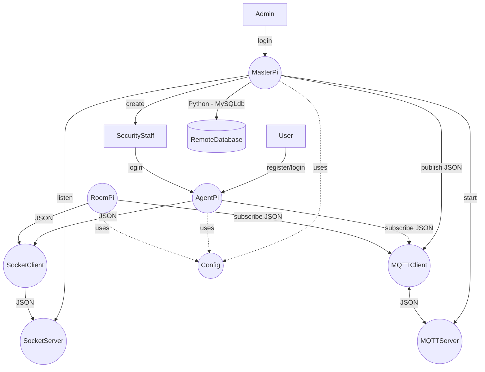

# Room Manager


## Authors 
<p align="center">

| Name          |
| -------------------- |
| Natchanon Laoharawee |
| Jake Parkinson       |
| Ethan Zhang          |
| Max Caruana          |

</p>

---

## System Architecture

<p align="center">
This repository contains a distributed IoT classroom management system for a university teaching
environment. The system involves multiple Raspberry Pi devices that operate as Agent Pis (for
users/staff) and Room Pis (for room access & display), coordinated by a central Master Pi.
Communication across devices is implemented using MQTT (publish-subscribe) and Socket
Programming (request-response), and data is persisted in a centralized remote database,
accessible only from the Master Pi.<br>
<p align="center">
The system can be tested and developed using Docker and Docker compose. A single device can run the Dockerfile with the correct environment variables in production.<br>
</p>

Below is a general overview of the system:


---

## Features


### Room Pi:
Periodically send room temperature, humidity, pressure on web interface <br>
Display room status (in-use, available, faulty, maintenance) on SenseHat screen <br>
Check-in to room (Token validation) <br>


### Agent Pi:
Registration<br>
Login/Logout<br>

Search rooms by availability + time<br>
Book room<br>
Cancel room<br>
Check-in to room<br>


### Master Pi:
Store logs<br>

Admin login<br>
Admin create/edit/view/delete accounts<br>
View booking logs<br>
View usage logs<br>
Generate reports<br>

Staff login<br>
Publish announcements & upcoming room bookings<br>
Change room status to faulty or maintenance<br>
Check-in to room (Token validation) (Admin check-in)<br>


### Other tasks:
Create database<br>
Custom Enhancement 1 - QR Login<br>
Custom Enhancement 2 - Speech to Text for announcements<br>

### Unit tests:
User input validation<br>
Authentication and booking logic<br>
MQTT and socket communication<br>
Room state transitions<br>
Exception handling<br>
Custom enhancement<br>

## Contents

### Documents

- ### [Group Effort Document](./documentation/Group3_GroupEffort.pdf)
- ### [Design Patterns Summary Document](./documentation/Group3-DesignPatterns%20SummaryDocument.pdf)
- ### [Test Plan](./documentation/test_plan.md)

### Source Code

- ### [Master Pi](./src/pi_roles/master_pi/)
- ### [Agent Pi](./src/pi_roles/agent_pi/)
- ### [Room Pi](./src/pi_roles/room_pi/)

## Dependencies

- **Docker Compose** (v2.8 or higher)
- **Docker** (latest recommended)
- (Optional) For running the code locally - Additional Python packages listed in [`requirements.txt`](./requirements.txt)
- (Optional) **Python** (v3.10+)
- (Optional) **MySQL** (for remote database)
- (Optional) **MQTT Broker** (e.g., Mosquitto)

### To install dependencies on Raspberry Pi:
```bash
# Update system 
sudo apt update && sudo apt upgrade -y

# Install Docker
curl -sSL https://get.docker.com | sh

# Add current user to Docker group, otherwise you must use sudo with docker
sudo usermod -aG docker $USER

# Reboot to apply group changes
sudo reboot now
```

## To run the whole system (on one computer):
```bash
# To run default system for development and testing, (1 master, 1 agent, 1 room)
docker compose up -d
# (Optional) run multiple containers (1 master, 3 agent, 3 room)
docker compose up -d --scale agent=3 --scale room=3
# Look at running and offline containers and their respective ports
docker ps -a
# Follow the logs of a container
docker logs <container-name> -f
# Stop running containers
docker compose down
```

## To run a single device:
```bash
# To run a single device and simulate for production, set the required environment variables and build/run the container:
docker build -t <image_name> .
# Look at the images
docker images
# Run the image, using the chosen env file (some env files are given at the bottom of this file)
docker run --env-file <env_file> -p <desired_port>:<web_port> -v ./src:/iot-app/src <image_name>
# Look at running and offline containers and their ports
docker ps -a
```
## Example Env file when using docker compose
```properties
# Flag to simulate production environment, uncomment to enable
# SIMULATE_PROD=--sim

# Flask Secret Key
SECRET_KEY=a8f5f167f07f0def8e8b3c2b8f89e7c9d4e3f2a1b5c6d7e8f9a0b1c2d3e4f5a6

DB_ROOT_USER=root
DB_ROOT_PASSWORD=1234!

DB_USER=piot_user
DB_PASSWORD=1234!
DB_NAME=piot_database

# MQTT Broker configuration
MQTT_BROKER_HOST=mqtt  # <mqtt> when running system via Docker OR <ip-addr> when running single device
MQTT_BROKER_PORT=1883

# Master device configuration
MASTER_HOST=master  # <master> when running system via Docker OR <ip-addr> when running single device
MASTER_PORT=5001
MASTER_SOCKET_PORT=6001
MASTER_IP_ADDR1=192.168.100
MASTER_IP_ADDR2=192.168.101

# Agent device configuration
AGENT_PORT=5002
AGENT_SOCKET_PORT=6002
AGENT_IP_ADDR1=192.168.100
AGENT_IP_ADDR2=192.168.101
AGENT_IP_ADDR3=192.168.102

# Room device configuration
ROOM_PORT=5003
ROOM_SOCKET_PORT=6003
ROOM_IP_ADDR1=group-assignment-group-3-room-1   # <group-assignment-group-3-room-1> when running system via Docker OR <ip-addr> when running single device
ROOM_IP_ADDR2=group-assignment-group-3-room-2
ROOM_IP_ADDR3=group-assignment-group-3-room-3
```

## Master Pi Env file
```properties
# Flag to simulate production environment, uncomment to enable
# SIMULATE_PROD=--sim

# Flask Secret Key
SECRET_KEY=a8f5f167f07f0def8e8b3c2b8f89e7c9d4e3f2a1b5c6d7e8f9a0b1c2d3e4f5a6

DB_ROOT_USER=root
DB_ROOT_PASSWORD=1234!

DB_USER=piot_user
DB_PASSWORD=1234!
DB_NAME=piot_database

# MQTT Broker configuration
MQTT_BROKER_HOST=mqtt  # <mqtt> when running system via Docker OR <ip-addr> when running single device
MQTT_BROKER_PORT=1883

# Per-Device configuration
IS_DOCKER=true
# Set to true for when running the mariadb container for the masterpi to initialize the database
DB_INIT_CONFIG=true
ROLE=master
IP_ADDRESS=<127.0.0.1> # Set to the ip address of your device in the network
HOST=0.0.0.0
PORT=5001
SOCKET_HOST=0.0.0.0
SOCKET_PORT=6001
REMOTE_DB_HOST=remote-db

# Master device configuration
MASTER_HOST=master # Set to the ip address of the master device in the network
MASTER_PORT=5001
MASTER_SOCKET_PORT=6001
MASTER_IP_ADDR1=192.168.100
MASTER_IP_ADDR2=192.168.101

# Agent device configuration
AGENT_PORT=5002
AGENT_SOCKET_PORT=6002
AGENT_IP_ADDR1=192.168.100
AGENT_IP_ADDR2=192.168.101
AGENT_IP_ADDR3=192.168.102

# Room device configuration
ROOM_PORT=5003
ROOM_SOCKET_PORT=6003
ROOM_IP_ADDR1=192.168.200
ROOM_IP_ADDR2=192.168.201
ROOM_IP_ADDR3=192.168.202
```
## Agent Pi Env file
```properties
# Flag to simulate production environment, uncomment to enable
# SIMULATE_PROD=--sim

# Flask Secret Key
SECRET_KEY=a8f5f167f07f0def8e8b3c2b8f89e7c9d4e3f2a1b5c6d7e8f9a0b1c2d3e4f5a6

DB_ROOT_USER=root
DB_ROOT_PASSWORD=1234!

DB_USER=piot_user
DB_PASSWORD=1234!
DB_NAME=piot_database

# MQTT Broker configuration
MQTT_BROKER_HOST=mqtt  # <mqtt> when running system via Docker OR <ip-addr> when running single device
MQTT_BROKER_PORT=1883

# Per-Device configuration
IS_DOCKER=true
ROLE=agent
IP_ADDRESS=<127.0.0.1> # Set to the ip address of your device in the network
HOST=0.0.0.0
PORT=5002
SOCKET_HOST=0.0.0.0
SOCKET_PORT=6002
REMOTE_DB_HOST=remote-db

# Master device configuration
MASTER_HOST=master # Set to the ip address of the master device in the network
MASTER_PORT=5001
MASTER_SOCKET_PORT=6001
MASTER_IP_ADDR1=192.168.100
MASTER_IP_ADDR2=192.168.101

# Agent device configuration
AGENT_PORT=5002
AGENT_SOCKET_PORT=6002
AGENT_IP_ADDR1=192.168.100
AGENT_IP_ADDR2=192.168.101
AGENT_IP_ADDR3=192.168.102

# Room device configuration
ROOM_PORT=5003
ROOM_SOCKET_PORT=6003
ROOM_IP_ADDR1=192.168.200
ROOM_IP_ADDR2=192.168.201
ROOM_IP_ADDR3=192.168.202
```

## Room Pi Env file
```properties
# Flag to simulate production environment, uncomment to enable
# SIMULATE_PROD=--sim

# Flask Secret Key
SECRET_KEY=a8f5f167f07f0def8e8b3c2b8f89e7c9d4e3f2a1b5c6d7e8f9a0b1c2d3e4f5a6

DB_ROOT_USER=root
DB_ROOT_PASSWORD=1234!

DB_USER=piot_user
DB_PASSWORD=1234!
DB_NAME=piot_database

# MQTT Broker configuration
MQTT_BROKER_HOST=mqtt  # <mqtt> when running system via Docker OR <ip-addr> when running single device
MQTT_BROKER_PORT=1883

# Per-Device configuration
IS_DOCKER=true
ROLE=room
IP_ADDRESS=<127.0.0.1> # Set to the ip address of your device in the network
HOST=0.0.0.0
PORT=5003
SOCKET_HOST=0.0.0.0
SOCKET_PORT=6003
REMOTE_DB_HOST=remote-db

# Master device configuration
MASTER_HOST=master # Set to the ip address of the master device in the network
MASTER_PORT=5001
MASTER_SOCKET_PORT=6001
MASTER_IP_ADDR1=192.168.100
MASTER_IP_ADDR2=192.168.101

# Agent device configuration
AGENT_PORT=5002
AGENT_SOCKET_PORT=6002
AGENT_IP_ADDR1=192.168.100
AGENT_IP_ADDR2=192.168.101
AGENT_IP_ADDR3=192.168.102

# Room device configuration
ROOM_PORT=5003
ROOM_SOCKET_PORT=6003
ROOM_IP_ADDR1=192.168.200
ROOM_IP_ADDR2=192.168.201
ROOM_IP_ADDR3=192.168.202
